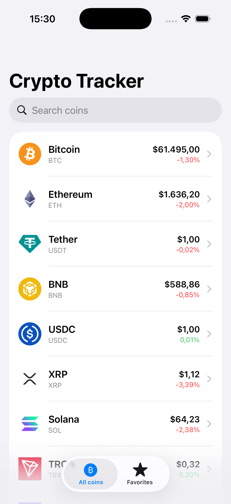
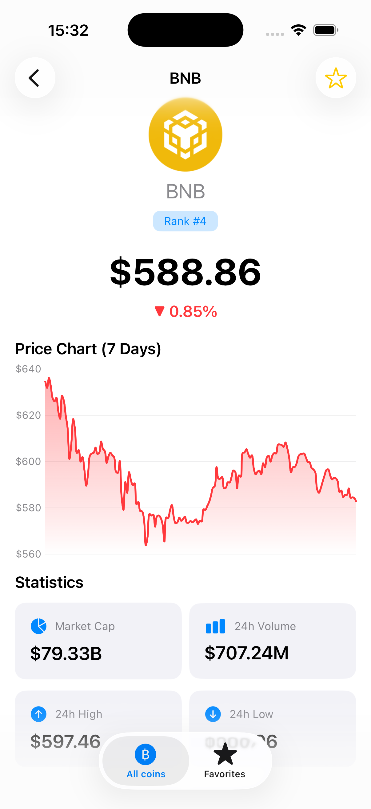
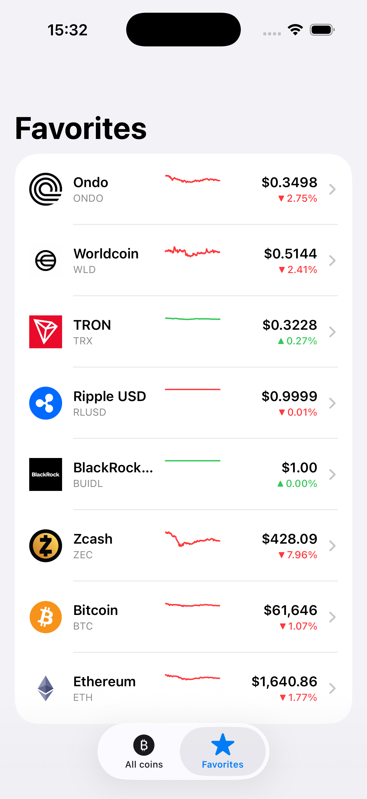

# 📈 CryptoTracker Pro

A modern iOS app to track cryptocurrency prices in real-time. Built with SwiftUI and the latest Apple frameworks.


## 📱 About The App

CryptoTracker Pro is an iOS app for cryptocurrency enthusiasts and investors who want to track real-time prices of digital assets. The app provides live market data for the top 50 cryptocurrencies, interactive price charts, and a personalized favorites system. It is designed for users who want a clean, fast, and reliable way to monitor crypto prices on their iPhone.

## ✨ Features

- View top 50 cryptocurrencies with live market data
- Real-time prices in USD with auto-refresh every 30 seconds
- 24-hour price change indicators with up/down arrows
- Search and filter coins in real-time
- Save favorite coins with persistent storage
- Interactive 7-day price charts with gradient fills
- Mini sparkline charts for trend visualization
- Pull-to-refresh on both Home and Favorites screens
- Swipe-to-delete favorites
- Empty states and error handling
- Smart formatting for prices across all magnitudes

## 📸 Screenshots

<p align="center">
  
  
  
</p>

## 🛠 Technologies Used

- **Swift 5.9** - Programming language
- **SwiftUI** - Declarative UI framework
- **Swift Concurrency** - async/await for asynchronous operations
- **Swift Charts** - Native chart visualization
- **SwiftData** - Modern local persistence framework
- **URLSession** - Network requests
- **MVVM** - Architecture pattern
- **CoinGecko API** - Cryptocurrency market data

## 🏗 Architecture

The app follows the **MVVM (Model-View-ViewModel)** architecture pattern with clear separation of concerns:

- **Models** - Data structures representing API responses and persistent entities (Coin, FavoriteCoin, FavoriteCoinDetails)
- **Views** - SwiftUI screens responsible only for rendering UI
- **ViewModels** - Business logic, data formatting, and state management (5 dedicated ViewModels)
- **Services** - Networking layer with protocol-based design for testability
- **Persistence** - SwiftData with @Model and @Query for reactive data storage

This separation ensures the code is testable, maintainable, and easy to extend.

## 🌐 API Used

The app integrates with the [CoinGecko API](https://www.coingecko.com/en/api), a free and reliable cryptocurrency data provider.

**Data fetched:**
- Current prices in USD
- Market capitalization and rankings
- 24-hour price change percentage
- 24-hour high and low prices
- Trading volume
- 7-day sparkline price history (168 data points)
- Coin metadata (name, symbol, image)

**Endpoint used:**

No API key is required, making the app easy to run out of the box.


## 🚀 Getting Started

Follow these steps to run the app on your machine:

### 1. Clone the Repository

```bash
git clone https://github.com/sharvanik21/CryptoTrackerPro.git
```

### 2. Navigate to the Project Folder

```bash
cd CryptoTrackerPro
```

### 3. Open the Project in Xcode

```bash
open CryptoCurrencyTracker.xcodeproj
```

### 4. Run the App

- Select an iOS Simulator (iPhone 15 Pro recommended)
- Press **⌘ + R** to build and run the app

---

## ✅ Requirements

- iOS 17.0+
- Xcode 15.0+
- Swift 5.9+
- macOS 14.0+

---

## 📂 Project Structure

```text
CryptoTrackerPro
├── App
│   └── CryptoCurrencyTrackerApp.swift
├── Models
│   ├── Coin.swift
│   ├── FavoriteCoin.swift
│   └── FavoriteCoinDetails.swift
├── Services
│   ├── NetworkService.swift
│   └── CoinService.swift
├── ViewModels
│   ├── HomeViewModel.swift
│   ├── DetailViewModel.swift
│   ├── FavoritesViewModel.swift
│   ├── FavoriteRowViewModel.swift
│   └── PriceChartViewModel.swift
└── Views
    ├── MainTabView.swift
    ├── Home
    │   ├── HomeView.swift
    │   └── CoinRowView.swift
    ├── Detail
    │   └── CoinDetailView.swift
    ├── Favorites
    │   ├── FavoritesView.swift
    │   ├── FavoriteRow.swift
    │   └── EmptyFavoritesView.swift
    └── Components
        ├── PriceChartView.swift
        ├── StatCard.swift
        └── ErrorView.swift
```

---

## 🎯 Technical Challenges & Solutions

### Challenge 1: Generating Clean Y-Axis Labels Across Different Price Ranges

**Problem:** Default chart labels showed random values like `$73,142`, `$74,389` for Bitcoin and duplicate values like `$1`, `$1`, `$1` for low-priced coins like XRP.

**Solution:** Implemented Heckbert's "Nice Numbers" algorithm (Graphics Gems, 1990) to generate human-readable Y-axis values that always round to clean intervals (1, 2, 5, 10 multipliers). The same logic now produces `$73K`, `$74K`, `$75K` for Bitcoin and `$1.28`, `$1.30`, `$1.32` for XRP.

---

### Challenge 2: Chart Looked Broken for Stablecoins

**Problem:** Coins like USDC, USDT, and BUIDL have nearly identical prices ($1.00), which made the chart look broken with a flat line and washed-out gradient.

**Solution:** Designed a `ChartState` enum (`normal`, `stable`, `noData`, `insufficientData`) and created a dedicated UI for stablecoins showing a centered dashed line with a "Stable Price" badge.

---

### Challenge 3: Merging Persistent and Live Data

**Problem:** Favorites stored in SwiftData only contained basic info (id, symbol, name) and didn't have live prices.

**Solution:** Created a `FavoriteCoinDetails` model that combines a `FavoriteCoin` (from SwiftData) with a matching `Coin` (from API). The `FavoritesViewModel` performs the merge operation, allowing the UI to display saved coins with live market data.

---

### Challenge 4: Price Formatting for Wildly Different Magnitudes

**Problem:** A single formatter couldn't handle prices ranging from Bitcoin ($73,456) to Shiba Inu ($0.00002345) readably.

**Solution:** Built an adaptive formatting strategy using switch statements on price magnitude, dynamically setting `minimumFractionDigits` and `maximumFractionDigits` on `NumberFormatter`.

---

## 👨‍💻 Author

**Sharvani Karrepu**

- LinkedIn: https://linkedin.com/in/sharvanikarrepu
- GitHub: https://github.com/sharvanik21
- Email: sharvanikarrepu@gmail.com
